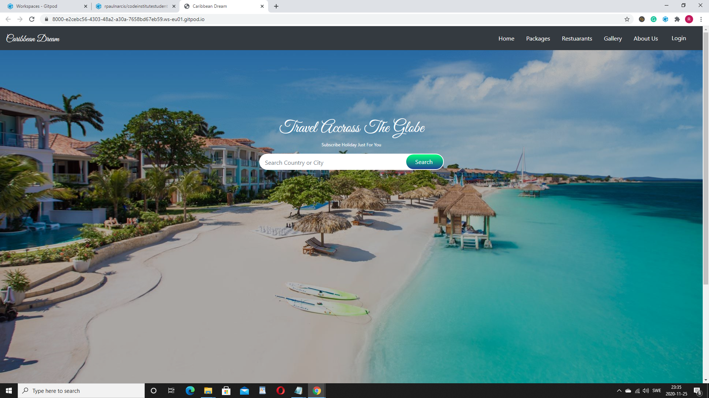

MileStone README.md

### **My second Milestone Project**

Welcome! [View live project here]

Milestone Project Home Page

### **UX - User Experience Design:**
This website was created for Caribbean Dream Travel, the goal is to encourage users to purchase our packages and overall use the website for all vacation purposes, through our competitive prices and quality service. Through this project, I offer strong advertising, through visual, typography, colors, interaction, and easy navigational tools. Engaging existing customers, improving customer satisfaction through better service, simplifying and optimizing content updates, and website management, to grow the company and, increase profitability.

#### User Stories
- As a first - time visitor, I want to easily understand the project from the moment I get to the landing page.
- As a first - time visitor, I want to easily be able to navigate, be able to go back and forth to pages quickly.
- As a first - time visitor, I want the project to not be too exhausting to look at.
- As a first - time visitor, I want to able to pick back up from where I left off, so I can simply just carry on if I took a break? 
- As a first - time visitor, I would like to be able to create a new account.
- As an existing - user, I would like to actually want to travell once visited the site.

#### Wireframes, mockups, diagrams, etc

#### Wireframe 1:
Home Page 
#### Wireframe 2:
Packages Page 
#### Wireframe 3:
Restuarants Page 
#### Wireframe 4:
Gallery Page
#### Wireframe 5:
About Us Page 
### **Features:**
#### Features presented across the project

#### Features presented on individual pages

#### Home page

#### Packages page 

#### Restuarants page

#### Gallery page

#### about Us page

#### Features Left to Implement

### **Technologies Used:**
- [HTML](https://developer.mozilla.org/en-US/docs/Web/HTML)
    - Used as the building block for the project and to structure the content.
- [CSS](https://developer.mozilla.org/en-US/docs/Learn/Getting_started_with_the_web/CSS_basics)
    - Used to style all the web content across the project.
- [Bootstrap](https://getbootstrap.com/)
    - Used as the main framework to make the project responsive.
- [jQuery](https://jquery.com/)
    - Used with Bootstrap to make the navbar responsive.
- [JavaScript](https://www.javascript.com/)
    - Used for the Bootstrap navbar extending collapse plugin to implement responsive behavior.
- [Google Fonts](https://fonts.google.com/)
    - Used to obtain the fonts linked in the header, fonts used were Roboto and Exo.
- [Font Awesome](https://fontawesome.com/)
    - Used to obtain social media icons used in the footer.
- [Google Developer Tools](https://developers.google.com/web/tools/chrome-devtools)
    - Used as a primary method of fixing spacing issues, finding bugs, and testing responsiveness across the project.
- [Github](https://github.com/)
    - Used to store code for the project after being pushed.
- [Git](https://git-scm.com/)
    - Used for version control by utilizing the Gitpod terminal to commit to Git and push to GitHub.
- [Gitpod](https://www.gitpod.io/)
    - Used as the development environment.
- [Balsamiq] 
    - Used to create Wireframes for the project.
- [AutoPrefixer](https://autoprefixer.github.io/)
    - Used to parse my CSS and vendor prefixes.
- [Grammarly](https://app.grammarly.com/)
    - Used to fix grammar errors across the project.    

### **Testing:**

#### User testing stories from User Experience Design (UX) Section

#### Further Testing

#### Syntax - HTML & CSS
<i class="far fa-clone"></i> Using https://validator.w3.org and filtering errors related to Angular (ex: no doctype,...)
- index.html (Home) &check;
- aboutus.html &check;
- gallery.html &check;
- classschedule.html &check;

<i class="far fa-clone"></i> Using https://jigsaw.w3.org/css-validator/ I validated the following spreadsheet:

- defaultStylesheet.css: &check;

#### Navigation
#### Navigation on Mobile

#### Navigation on Tablet:

#### Navigation on Desktop

#### Sign-Up /Sign button

#### Known Bugs and fixes

### **Deployment:**
- I Configured my milestone 2 Project Caribbean Dream website to display to GitHub pages and any file or files I push to the master.
#### Deployment Process
- Opened up GitHub in the browser.
- Signed in with my username and password.
- Selected my repositories.
- Navigated to rpnarcis/milestone1.
- In the top navigation click settings.
- Scrolled down to the GitHub Pages area.
- Selected Master Branch from the Source dropdown menu.
- Clicked to confirm my selection.
- rpaulnarcis/milestone1 is now live on GitHub Pages.
- Your site is published at https://rpaulnarcis.github.io/milestone1/

### **Authors:**
- This project was created by Robert P Narcis an upcoming full-stack software developer.
### **Credits:**

### **Content:**
 
### **Media:**
- All images are random images from the internet.
### **Acknowledgements:**
