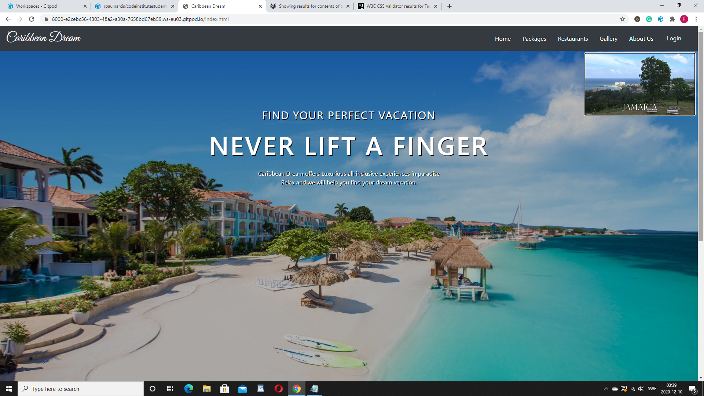

la

MileStone README.md

### **My second Milestone Project**

Welcome! [View live project here](https://rpaulnarcis.github.io/rpnarcis-milestone2/)

Milestone Project Home Page

### **UX - User Experience Design:**
This website was created for Caribbean Dream Travel, the goal is to encourage users to purchase our packages and overall use the website for all vocational purposes, through the sheer beauty of the vast landscape we exhibit coupled with our competitive prices and quality service. Through this project, I offer strong advertising, through visual, typography, colors, and interactivity, with easy navigational tools, which effortlessly leaders the user through the site leaving them with a strong urge to return over and over to plan their next adventure. Engaging existing customers, improving customer satisfaction through better service, simplifying and optimizing content updates, and website management, to grow the company and, increase profitability.

#### User Stories
- As a first-time visitor, I want to easily understand the project from the moment I get to the landing page.
- As a first-time visitor, I want to easily be able to navigate, be able to go back and forth to pages quickly.
- As a first-time visitor, I want the project to not be too exhausting to look at.
- As a first-time visitor, I want to able to pick back up from where I left off, so I can simply just carry on if I took a break? 
- As an existing - user, I would like to want to travel once visited the site.
- As an existing - user I will want to visit the site over and over to explore what awaits in the Caribbean.
#### Wireframes, mockups, diagrams, etc

#### Wireframe 1:
Home Page 
#### Wireframe 2:
Packages Page 
#### Wireframe 3:
Restuarants Page 
#### Wireframe 4:
Gallery Page
#### Wireframe 5:
About Us Page 
### **Features:**
#### Features presented across the project
- Navbar - Responsive, toggles to a hamburger menu at a width of 575 pixels. All links are a bright pink but go to a dark pink once clicked. There are links to all of the pages as well as a sign-in/sign-up button. The main logo acts as a link back to the home page.
- Footer comprises social links, contact information, as well as hours of operation.
- Consistent images are used throughout the project, which gives it a humane feel and helps to invoke user emotions. All images are relevant to the content.
- The contrast of fonts between header and proceeding text, both Roboto and Exo help bring the page to life.
#### Features presented on individual pages

#### Home page
- The home page has a warm feel to it with a hero image of a Caribbean beach resort, a video is loaded one can hear the sound of a steel pan as if you were already there.
#### Packages page 
- this page outline all the packages available. it gives both a visual and geological field to it with marked maps outlining the restaurants we partner with where a discount is possible.
#### Restuarants page
- A clear outline of the eating establishments we do business with displayed in a gallery format with each image linked to the website's home page.
#### Gallery page
- a beautiful image gallery display just some of the marvelous wonders that the Caribbean has to offer.
#### about Us page
- The about page is home to our mission statement followed by some Customers Reviews and our cancellation policies and practices.
#### Features Left to Implement
A places API map that searches for the locations by text.

### **Technologies Used:**
- [HTML](https://developer.mozilla.org/en-US/docs/Web/HTML)
    - Used as the building block for the project and to structure the content.
- [CSS](https://developer.mozilla.org/en-US/docs/Learn/Getting_started_with_the_web/CSS_basics)
    - Used to style all the web content across the project.
- [Bootstrap](https://getbootstrap.com/)
    - Used as the main framework to make the project responsive.
- [jQuery](https://jquery.com/)
    - Used with Bootstrap to make the navbar responsive.
- [JavaScript](https://www.javascript.com/)
    - Used for the Bootstrap navbar extending collapse plugin to implement responsive behavior.
    - Used for the calculator so members can calculate the prices where discounts are given.
- [Google Fonts](https://fonts.google.com/)
    - Used to obtain the fonts linked in the header, fonts used were Great Vibes'and News Cycle.
- [Font Awesome](https://fontawesome.com/)
    - Used to obtain social media icons used in the footer.
- [Google Developer Tools](https://developers.google.com/web/tools/chrome-devtools)
    - Used as a primary method of fixing spacing issues, finding bugs, and testing responsiveness across the project.
- [Github](https://github.com/)
    - Used to store code for the project after being pushed.
- [Git](https://git-scm.com/)
    - Used for version control by utilizing the Gitpod terminal to commit to Git and push to GitHub.
- [Gitpod](https://www.gitpod.io/)
    - Used as the development environment.
- [Balsamiq] 
    - Used to create Wireframes for the project.
- [AutoPrefixer](https://autoprefixer.github.io/)
    - Used to parse my CSS and vendor prefixes.
- [Grammarly](https://app.grammarly.com/)
    - Used to fix grammar errors across the project.    

### **Testing:**

#### User testing stories from User Experience Design (UX) Section
- One can easily understand the project from its warm beautiful Caribbean layout to the sound of steel pan and a video that gives the user a first-hand experience of the Caribbean culture and some of what it has to offer.

- Navigation is simply easy to use easily visible moving back and forth through the page is very easy also at the footer Deals & Offers, Customers Reviews, and Cancelation Policies take you to the various pages where they exist.

- This project is very exciting with lots of images that tell lots of stories while the untamed beauty of the Caribbean unfoldes right before your eyes.

It's Not a complicated site at all one can easily pick back up where they left off.

- On visiting one will definitely want to travel even if the thought did not exist in the mind before.

- Yes one will seldom get tired of visiting as the landscape and array of images and stories are vast.
#### Further Testing
- The project was tested on the following browsers with success, Google Chrome, Microsoft Edge,  Mozilla Firefox, and Opera.
- The project was manually tested on  Apple iPhone 8 Plus with success.
- Google Chrome Developer tools and responsivetesttool.com were used throughout the project to help with responsiveness across devices.
- Google Chrome Development tools and responsivetesttool.com used to emulate devices.

#### Syntax - HTML & CSS
<i class="far fa-clone"></i> Using https://validator.w3.org and filtering errors related to Angular (ex: no doctype,...)
- index.html (Home) &check;
- aboutus.html &check;
- gallery.html &check;
- classschedule.html &check;

<i class="far fa-clone"></i> Using https://jigsaw.w3.org/css-validator/ I validated the following spreadsheet:

- defaultStylesheet.css: &check;

#### Navigation
#### Navigation on Mobile
- On mobile, the menu is collapsed when I start.
- The menu opens and droops down when I click on the hamburger icon.
- Only four links are present.- All four links work.
- The menu collapsed back when I click on all four links.
- The menu collapsed back when I click on the hamburger menu.
- All five links work.
#### Navigation on Tablet:
 The menu is not collapsable no hamburger is present.
- There are five links and a log-in button. 
- All five links work.
#### Navigation on Desktop
- The menu is not collapsable no hamburger is present.
-There are five links and a log-in button.
- All five links work.
#### Sign-Up /Sign button
- One exists in the right corner through the bootstrap model.
#### Known Bugs and fixes
The project runs a little slow once the video on the home page is implemented.
Was not able to get password validation through the bootstrap form model.
### **Deployment:**
- I Configured my milestone 2 Project Caribbean Dream website to display to GitHub pages and any file or files I push to the master.
#### Deployment Process
- Opened up GitHub in the browser.
- Signed in with my username and password.
- Selected my repositories.
- Navigated to rpnarcis/milestone1.
- In the top navigation click settings.
- Scrolled down to the GitHub Pages area.
- Selected Master Branch from the Source dropdown menu.
- Clicked to confirm my selection.
- rpaulnarcis/milestone1 is now live on GitHub Pages.
- Your site is published at https://rpaulnarcis.github.io/rpnarcis-milestone2

### **Authors:**
- This project was created by Robert P Narcis an upcoming full-stack software developer.
### **Credits:**
Maps and markers were done by me.
Easy Tutorials on YouTube Channel.
### **Content:**
Calculator: https://codepen.
Other content is taken from random places online.
### **Media:**
- Some Images were taken Top destinations in the Caribbean.
- Video came from youtube.
- All images are random images from the internet.
### **Acknowledgements:**
Easy Tutorials on YouTube Channel.
Code Institute course Tutorials.